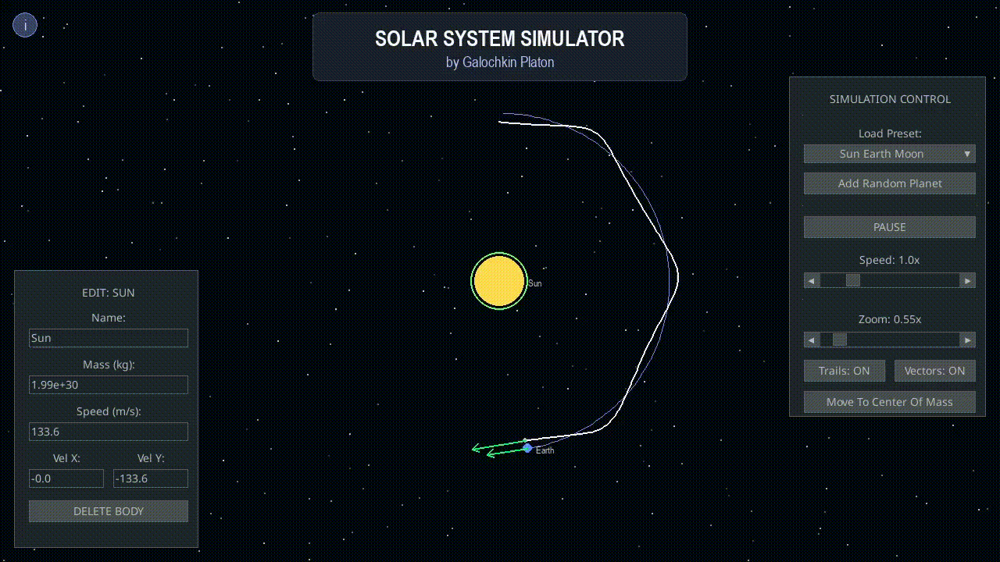

# Solar System Simulator

This program assists educators and students in exploring celestial mechanics and gravitational systems. It enables real-time visualization of n-body gravitational interactions with physical accuracy, allowing users to simulate various solar system configurations, from simple planetary orbits to complex chaotic systems.

  

### Key Features
* **Real-Time Editing:** Select any celestial body to instantly modify its name, mass, and velocity parameters on the fly.
* **Interactive Vectors:** Click and drag velocity vectors to directly alter orbital trajectories and experiment with physics.
* **Built-in Scenarios:** Instantly load predefined configurations, including the Solar System, a Sun-Earth-Moon model, or chaotic n-body environments.
* **Visual Tools:** Toggle orbital trails, display velocity vectors, and smoothly lock the camera to the system's center of mass.

### Compatibility
* **Windows:** Windows 7 - Windows 11 (x64)
* **macOS:** 10.15+
* **Linux:** Distributions with Python 3.8+

---
*Created by P.A. Galochkin (@pentalux). All rights reserved.*
